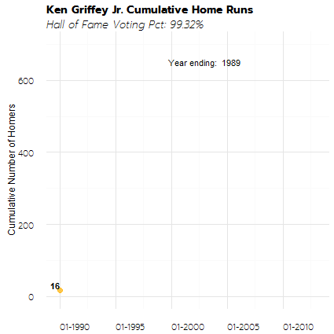

# Ken Giffy Jr
Stuart_Quinn  
`r format(Sys.time(), '%d %B, %Y')`  

#Background
R serves a number of functions, including the ability to create GIFs. There are a few requirements in order to make GIFs and I will elaborate on some of the troubleshooting issues that I came across while attempting to put this together. I should mention that I am using Windows, which may be a large part of why I was confronted with some of the aforementioned issues. 

As is usually the case in R, there is certainly another way to do this and likely a more effecient way (such as gganimate package), but this may serve as a starting point. The three key packages for this are **ggplot**, **animate** and **imageMagick**. We will walk through a few of the finer points before building our visual. 

#Installing Packages & Dependencies

[imageMagick][1] is an image processing tool that will need to be installed prior to get started. You can go directly to their site or install within **R**. We will also introduce some of our accompanying packages that we will use throughout. 

Within the ImageMagick installation wizard, make sure that when you are **offered options to select installation features you select: (1) set path automatically and (2) install legacy features (e.g. convert).**


```r
#For downloading and installing the latest version of imageMagick
if(!require(installr)){
  install.packages('installr')
  library(installr)
}

#install.ImageMagick() #downloads directly and will walk you through the wizard

#Uses ImageMagick within some wrapped functions -- specifically "convert" in this process
if(!require(animation)){
  install.packages('animation')
  library(animation)
}
```

Once installed and attached, read through the **notes** section of **?im.convert** for additional background and examples for reference. Finally, we will finish installing the additional packages you will need.


```r
#Building plots -- see notes below about latest version
if(!require(ggplot2)){
  install.packages('ggplot2')
  library(ggplot2)
}

#Manipulating the data we load
if(!require(dplyr)){
  install.packages('dplyr')
  library(dplyr)
}

#Easy handling of dates
if(!require(lubridate)){
  install.packages('lubridate')
  library(lubridate)
}

#Options for apperance of visuals
if(!require(ggthemes)){
  install.packages('ggthemes')
  library(ggthemes)
}

#Supplemental font-families
if(!require(extrafont)){
  install.packages('extrafont')
  library(extrafont)
}

#Supplemental font-families
if(!require(extrafontdb)){
  install.packages('extrafontdb')
  library(extrafontdb)
}

#For installing latest version of non-CRAN ggplot2
if(!require(devtools)){
  install.packages('devtools')
  library(devtools)
}

#Better formatting for our plot scales
if(!require(scales)){
  install.packages('scales')
  library(scales)
}

if(!require(knitr)){
  install.packages('knitr')
  library(knitr)
}

if(!require(rmarkdown)){
  install.packages('rmarkdown')
  library(rmarkdown)
}

devtools::install_github('hadley/ggplot2') #Latest non-CRAN version allows for caption and subtitle
library(ggplot2)
```

#Load Data

Next we will load our data -- in this case, career stats for Ken Griffey Jr. from [baseball-reference.com][2]. For our purposes, I have already cleaned up some of the aggregated statistics and removes the symbols (*) that do not handle well.

After loading, we will do some minor manipulation to get the cumulative number of home runs that Ken Griffey Jr. hit over his career. 


```r
#getwd()
#setwd()

#Load data that has been downloaded from baseball reference and cleaned
d <- read.csv("griffey_stats.csv", header = T)

#We will want to have dates as our x-axis, so we create end of year date
d$date <- as.Date(paste(d$Year, 12, 31, sep = "-"))

#Using dplyr, we now calculate the cumulative number of homeruns over the years
dCumHomer <- d%>%
  select(date, HR)%>%
  mutate(cumulHomer = cumsum(HR))

#we can drop the annual home run category now that we have the cumulative
dCumHomer <- dCumHomer%>%
  select(-HR)

#Change column names 
colnames(dCumHomer) <- c("date", "value")  
```

Before we begin creating our animated GIF, we will review the workhorse function in the **animation** package by reading through **?ani.options**. This allows us to control whether the GIF loops, the timing of intervals (essentially the frames), the output file type, size, title etc. There are also "hidden" options that will be checked to call the "convert" application within the ImageMagick software you downloaded earlier. When you run the **saveGIF** function it should automatically find the convert.exe in your folders, however, you may need to set the direct path if you are receiving an error when running. 


```r
ani.options("convert")
ani.options(convert = "C:\\your\\program\\ImageMagick-version\\convert.exe")
```

#Begin Making the GIF

The code below will essentially take our data frame and create a ggplot line chart of the cumulative homeruns. The graphic will be overlaid by a colored dot that provides the current value, while working through the data frame. 

1. First we set the time interval we would like to proceed through each row of our dataset to display in graphical form. We will set it to 0.5 seconds.
2. Next we get length of data frame for our **for** statement
3. Then we plot the graph and create a pause at the end, we will also graph again in order to create a lengthier pause at the end of the GIF as generally the most recent information is the most interesting (in this case, the final cumulative figure for Ken Griffey Jr. over his career).


```r
ani.options(ffmpeg = "C://Program Files//ffmpeg") #This is for knitr only
ani.options(interval = 0.5) #seconds

i0 <- nrow(dCumHomer)

saveGIF({for (i in 1:i0) {
  #Call datset to plot and label
  g <- ggplot(data=dCumHomer, aes(x=date,y=value, label = value))+
    #Add line geom size and color
    geom_line(data=dCumHomer[1:i,], size = 1.5, color = '#005C5C')+
    #Create a more appealing y-scale by manually setting
    scale_y_continuous(limits = c(0, 700))+ 
    #Add a dot so we can easily see the progression of career home runs
    geom_point(data=dCumHomer[i,],colour = "#FFB612", size = 3, alpha = 0.75)+
    #Use scales to create a clean x-axis with dates
    scale_x_date(labels= date_format("%m-%Y"),
                 limits = as.Date(c("1989-12-31", "2012-12-31")))+
    #Annotate the dot following the line with the cumulative number of homeruns. Slightly offset to 
    #Ensure the viewer can actually see the value
    geom_text(data=dCumHomer[i,], aes(x = date, y = value + 15, label = value),
              hjust = 1, fontface = 'bold', nudge_x = 0.1, nudge_y=.075)+
    #Create title, subtitle and axis-titles, including reference
    labs(
      title = 'Ken Griffey Jr. Cumulative Home Runs',
      subtitle = 'Hall of Fame Voting Pct: 99.32%',
      x = '',
      y = 'Cumulative Number of Homers',
      reference = 'Stuart Quinn, source: baseball-reference.com'
    )+
    #Create a label at the top that top that will be a ticker of the year being shown
    annotate("text",x=as.Date("2002-12-31"), y=650, 
             label=paste("Year ending: ",d[i,1]))+
    #Clean up the theme -- see note at very end regarding the font-family being used, 
    #dependent on extrafont package
    theme_minimal() + 
    theme(
      axis.title.x = element_blank(),
      axis.text = element_text(size = 11, family = 'Prompt ExtraLight', hjust = 0),
      plot.title = element_text(size = 14, family = 'Prompt', face = 'bold'),
      plot.subtitle = element_text(size = 13, family = 'Prompt ExtraLight', face = 'italic')
    )
  print(g)
  ani.pause()
}

#Identical to the first -- creates a 5 second hold at the final point
#Where five is 10 frames at a 0.5 second a piece (as set in the ani.options)
  for (i2 in 1:10) {
  g <- ggplot(data=dCumHomer, aes(x=date,y=value, label = value))+ 
    geom_line(data=dCumHomer[1:i,], size = 1.5, color = '#005C5C')+
    scale_y_continuous(limits = c(0, 700))+ 
    geom_point(data=dCumHomer[i,],colour = "#FFB612", size = 3, alpha = 0.75)+
    scale_x_date(labels= date_format("%m-%Y"),
                 limits = as.Date(c("1989-12-31", "2012-12-31")))+
    geom_text(data=dCumHomer[i,], aes(x = date, y = value + 15, label = value),
              hjust = 1, fontface = 'bold', nudge_x = 0.1, nudge_y=.075)+
    labs(
      title = 'Ken Griffey Jr. Cumulative Home Runs',
      subtitle = 'Hall of Fame Voting Pct: 99.32%',
      x = '',
      y = 'Cumulative Number of Homers',
      reference = 'Stuart Quinn, source: baseball-reference.com'
    )+
    annotate("text",x=as.Date("2002-12-31"), y=650, 
             label=paste("Year ending: ",d[i,1]))+ 
    theme_minimal() + 
    theme(
      axis.title.x = element_blank(),
      axis.text = element_text(size = 11, family = 'Prompt ExtraLight', hjust = 0),
      plot.title = element_text(size = 14, family = 'Prompt', face = 'bold'),
      plot.subtitle = element_text(size = 13, family = 'Prompt ExtraLight', face = 'italic')
    )
    
  print(g)
  ani.pause()
  }
}, 
#Now back within saveGIF function where we set the name/type of the file and size
movie.name="giffy_take3.gif",ani.width = 425, ani.height = 425)
```

```
## [1] TRUE
```




> Note that the font-face was selected from [Google Fonts][3] and design is attributed to [Cadson Demak][4]

[1]: http://www.imagemagick.org/script/history.php
[2]: http://www.baseball-reference.com/players/g/griffke02.shtml
[3]: https://www.google.com/fonts/
[4]: http://cadsondemak.com/


